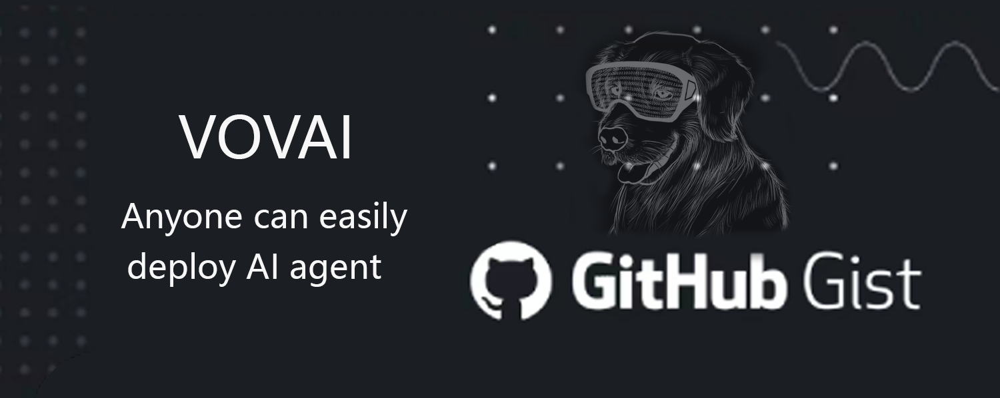

<h1 align="center">
     
</h1>

<a href="https://vovai.dev/">🔗 link</a>
<a href="https://x.com/VOVAI_DEV/">🔗  X</a>

 

## 📚 Docs

**You can find more info in the [docs](https://agentprotocol.ai/).**

## 🧾 Summary

The field of AI agents is still in its early stages, and most vendors are building agents in their own way. This makes communication between agents from different developers very challenging, as each interface is different. Imagine if we had a single communication interface between developers and agents—tools developed for use with agents would become much easier to create.

Therefore, **Solia** aims to standardize the 'agent protocol' as a universal interface for communication between users and agents. We are building a universal agent protocol, which any agent developer can adopt for their own use

The Agent Protocol is an API specification - list of endpoints, which the agent
should expose with predefined response models.
The protocol is **tech stack agnostic**. Any agent can adopt this protocol no
matter what framework they're using (or not using).

We believe, this will help the ecosystem grow faster and simplify the integrations.

We're starting with a minimal core. We want to build upon that iteratively
by learning from agent developers about what they actually need.

## 🚀 The incentives to adopt the protocol

- Ease with which you can use the benchmarks.
- Other people can more easily use and integrate your agent
- Enable building general devtools (for development, deployment and monitoring)
  that can be built on top of this protocol
- You don’t need to write boilerplate API and you can focus on developing your
  agent

## 🎯 Immediate goals of the protocol

Set a general simple standard that would allow for easy to use benchmarking of
agents. One of the primary goals of the protocol is great developer experience,
and simple implementation on the end of agent developers. You just start your
agent and that’s all you have to do.

## 🗣️ Request for Comments

If you'd like to propose a change or an improvement to the protocol. Please
follow the [RFC template](./rfcs/template.md).

## ⚙️ Components

### [Protocol](./schemas/openapi.yml)

The most important part. It specifies which endpoints should the agent expose.
The protocol is defined in [OpenAPI specification](./schemas/openapi.yml).

#### How does the protocol work?

Right now the protocol is defined as a REST API (via the
[OpenAPI spec](./schemas/openapi.yml)) with two essential routes for interaction with
your agent:

- `POST /ap/v1/agent/tasks` for creating a new task for the agent (for example giving
  the agent an objective that you want to accomplish)
- `POST /ap/v1/agent/tasks/{task_id}/steps` for executing one step of the defined task

It has also a few additional routes for listing the tasks, steps and downloading / uploading artifacts.

### [SDK](https://github.com/AI-Engineer-Foundation/agent-protocol/tree/main/packages/sdk)

This is our implementation of the protocol. It’s a library that you can use to build your agent. You can use it, or you can implement it on your own. It’s up to you.

Using the SDK should simplify the implementation of the protocol to the bare minimum, but at
the same time it shouldn't tie your hands. The goal should be to allow agent
builders to build their agents and the SDK should solve the rest.

Basically it wraps your agent in a web server that allows for communication with
your agent (and in between agents in the future).

### [Client](https://github.com/AI-Engineer-Foundation/agent-protocol/tree/main/packages/client)

This library should be used by the users of the agents. Your agent is deployed somewhere and the users of your agent can use this library to interact with your agent.

Thanks to the standard the users can try multiple agents without the need for any additional adjustments (or very minimal) in their code.

## 📦 How to use the protocol

If you're an agent developer, you can use the SDK to implement the protocol. You can find more info in the [docs](https://agentprotocol.ai/) or in the [SDK folder](./sdk).

## 🤗 Adoption

### Engaged projects in development of agent protocol

- [e2b](https://e2b.dev)
- [Auto-GPT](https://news.agpt.co/)

### Open-source agents and projects that have adopted Agent Protocol

- ✅ [Solia](https://github.com/SoliaAgentDEV/SoliaAgentGPT)
- ✅ [Auto-GPT-Forge](https://github.com/Significant-Gravitas/Auto-GPT-Forge)
- 🚧 [babyagi](https://github.com/yoheinakajima/babyagi)
  - Track [PR here](https://github.com/yoheinakajima/babyagi/pull/356). Waiting
    for merge.
- ✅ [smol developer](https://github.com/smol-ai/developer)
  - Track [PR here](https://github.com/smol-ai/developer/pull/123).
- 🚧 [beebot](https://github.com/AutoPackAI/beebot)
  - Might require more features. See
    [issue here](https://github.com/AI-Engineer-Foundation/agent-protocol/issues/9).

## 📃 High-level future roadmap

- Agent-to-agent communication
- Connection to the outside world:
  - 3rd party services (= “Agent I/O”)
  - Authentication on behalf of users
- Protocol Plugins
- Is there anything missing? Please submit an RFC with a proposed feature!

## 💬 Public discourse & development

- PRs and issues are welcome!
- Join [AIEF Discord](https://discord.gg/TxDzUWab) and their dedicated `agent-protocol` channel
- Join [Solia Discord]( https://discord.gg/DnuZbx8vjg ) and their dedicated
  `agent-protocol` channel
- Join [e2b Discord](https://discord.gg/U7KEcGErtQ) and their dedicated
  `agent-protocol` channel

## Star History

